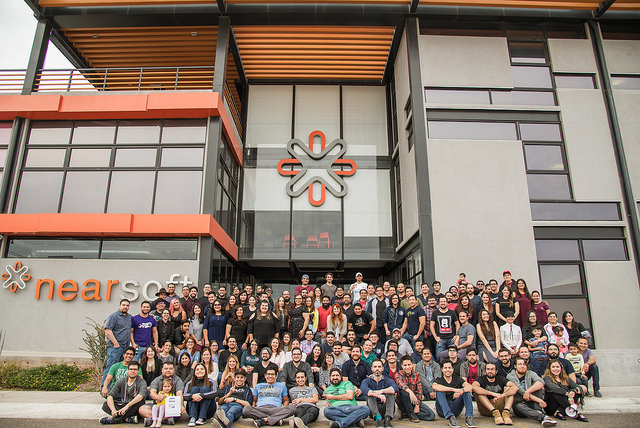
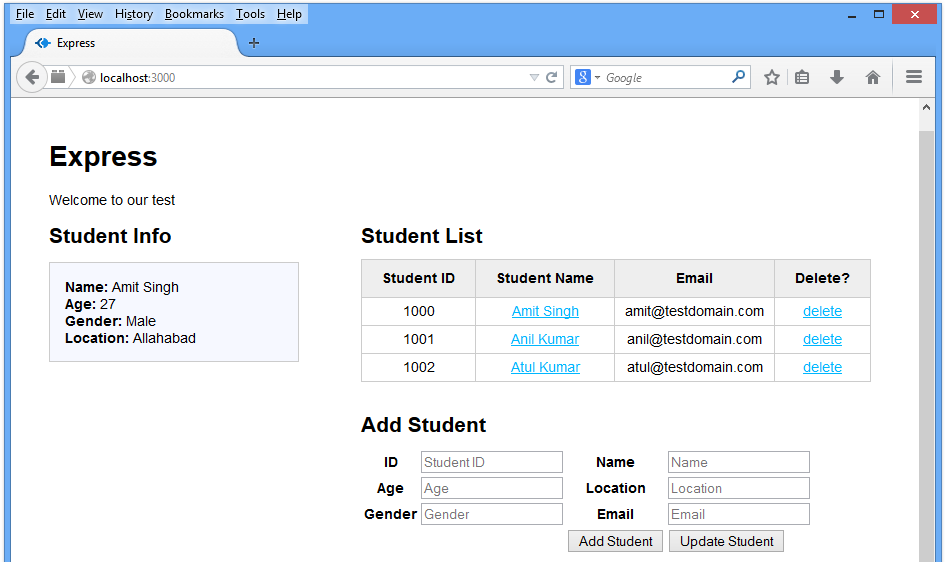
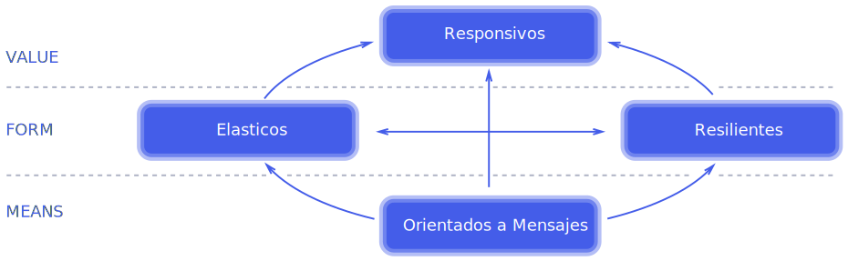

### Introducción a Programación Reactiva

por Esau Betancourt / [@elbetasal](https://twitter.com/elbetasal)

---
### ¿Quiénes somos?



+++
### Nearsoft Academy 


+++ 
### 3 Fases

- Test de lógica. |
- Entrevista en inglés. |
- Screen. |

---

###  



+++


<label style="font-size: 14px;"> Graphic by Wilgengebroed on Flickr [CC BY 2.0 (http://creativecommons.org/licenses/by/2.0)], via Wikimedia Commons</label>

+++
##### Reactive programming. 
A development model focusing on the observation of data streams, reacting on changes, and propagating them. 

+++ 

### Streams


+++
### No bloquees


+++ 

### ¿Cuándo usarlo?


+++

### Diseñando una API Reactiva

- Usa comunicación asíncrona via eventos | 
- Piensa en término de flujos de eventos. 

+++


###### Credit: [Jenkov.com](http://tutorials.jenkov.com/images/software-architecture/software-architecture-introduction-3.png)

+++
### Imperativa

```java
ResponseEntity<Double> piNumber = 
  restTemplate.exchange("http://localhost:8080/pi", 
    HttpMethod.GET, HttpEntity.EMPTY, Double.class, 
    new HashMap<>());
return "Hello "+ 
          name + 
        " your PI number is :" + 
        piNumber.getBody();
```
+++

### Reactiva
```java
Mono<Double> doubleMono = 
  webClient.get()
           .uri("/pi" , new HashMap<>())
           .retrieve()
           .bodyToMono(Double.class);
return doubleMono
  .map(a -> "Hello " +
            serverRequest.pathVariable("name") + 
            "your PI number is: "+ 
            a)
  .flatMap(helloWithPi -> ServerResponse.ok()
                          .contentType(MediaType.TEXT_PLAIN)
                          .body(BodyInserters
                                .fromObject(helloWithPi)));
```
---

#### Reactive system 
An architecture style used to build responsive and robust distributed systems based on asynchronous message-passing.

+++
### Reactive Manifiesto


--- 
### Futuros 

```
get()

get(long timeout, TimeUnit unit)
```

+++

### CompletableFuture

```

supplyAsync(Supplier<U> supplier)

thenAcceptAsync(Consumer<? super T> action)

thenComposeAsync(Function<? super T, ? extends CompletionStage<U>> fn)

thenCombineAsync(CompletionStage<? extends U> other,BiFunction<? super T,? super U,? extends V> fn)

exceptionally(Function<Throwable, ? extends T> fn)


```

---

### RxJava

 Es una librería Java que implementa las ReactiveX (extensiones reactivas ).</br> 
 `Se basa la composición asíncrona y programas basados en eventos , mediante el uso de secuencias observables.`

+++

 ### ¿Porqué?

 - Legibilidad | 
 - Simplicidad | 
 - Lazyness 
 

 +++ 

 ### Clases Base

- io.reactivex.Flowable: 0..N flows, supporting Reactive-Streams and backpressure | 
- io.reactivex.Observable: 0..N flows, no backpressure | 
- io.reactivex.Single: a flow of exactly 1 item or an error |
- io.reactivex.Completable: a flow without items but only a completion or error signal |
- io.reactivex.Maybe: a flow with no items, exactly one item or an error

