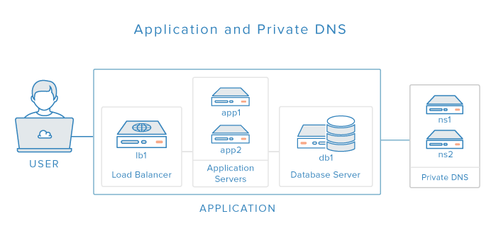

### Introducción a Programación Reactiva

por Esau Betancourt / [@elbetasal](https://twitter.com/elbetasal)

---
### ¿Quiénes somos?


+++
### Nearsoft Academy 


+++ 
### 3 Fases

- Test de lógica. |
- Entrevista en inglés. |
- Screen. |

---

###  



+++


<label style="font-size: 14px;"> Graphic by Wilgengebroed on Flickr [CC BY 2.0 (http://creativecommons.org/licenses/by/2.0)], via Wikimedia Commons</label>

+++
### Imperativa

```java
ResponseEntity<Double> piNumber = 
  restTemplate.exchange("http://localhost:8080/pi", 
    HttpMethod.GET, HttpEntity.EMPTY, Double.class, 
    new HashMap<>());
return "Hello "+ 
          name + 
        " your PI number is :" + 
        piNumber.getBody();
```
+++

### Reactiva
```java
Mono<Double> doubleMono = 
  webClient.get()
           .uri("/pi" , new HashMap<>())
           .retrieve()
           .bodyToMono(Double.class);
return doubleMono
  .map(a -> "Hello " +
            serverRequest.pathVariable("name") + 
            "your PI number is: "+ 
            a)
  .flatMap(helloWithPi -> ServerResponse.ok()
                          .contentType(MediaType.TEXT_PLAIN)
                          .body(BodyInserters
                                .fromObject(helloWithPi)));
```
+++
##### Reactive programming. 
A development model focusing on the observation of data streams, reacting on changes, and propagating them. 

+++ 
### No bloquees


+++ 

+++
### ¿Cuándo usarlo?


+++
### Streams


### Diseñando una API Reactiva

- Usa comunicación asíncrona via eventos. | 
- Piensa en término de flujos de eventos. 


+++


###### Credit: [Jenkov.com](http://tutorials.jenkov.com/images/software-architecture/software-architecture-introduction-3.png)

---

#### Reactive system 
An architecture style used to build responsive and robust distributed systems based on asynchronous message-passing.

+++
### Reactive Manifiesto


--- 
### Futuros 


+++

### CompletableFuture

```

supplyAsync(Supplier<U> supplier)

thenAcceptAsync(Consumer<? super T> action)

thenComposeAsync(Function<? super T, ? extends CompletionStage<U>> fn)

thenCombineAsync(CompletionStage<? extends U> other,BiFunction<? super T,? super U,? extends V> fn)

exceptionally(Function<Throwable, ? extends T> fn)


```
---
RxJava

---
Spring
